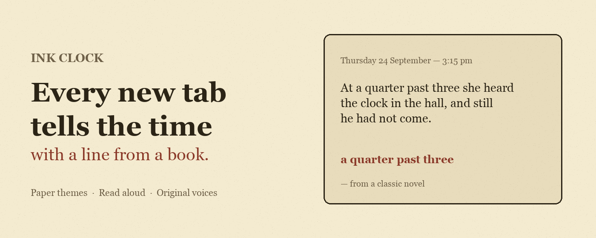
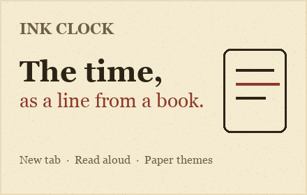
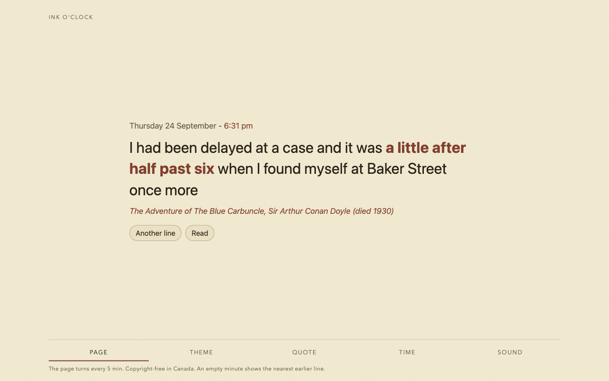
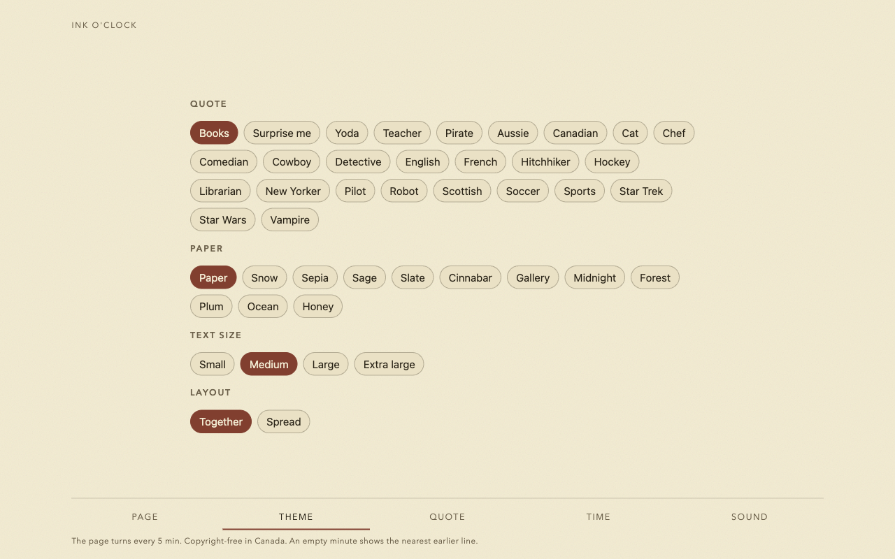
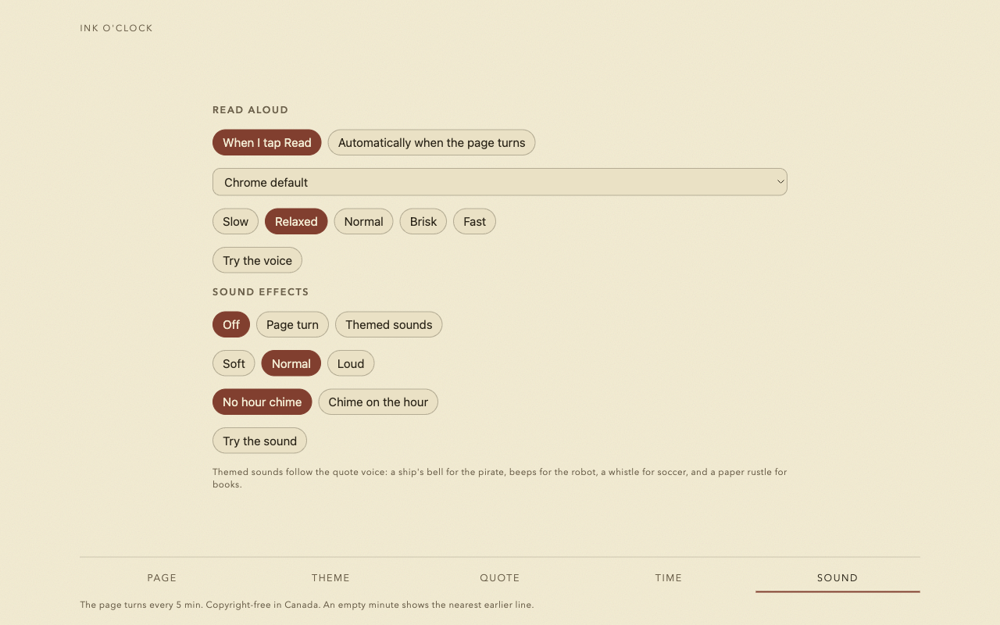
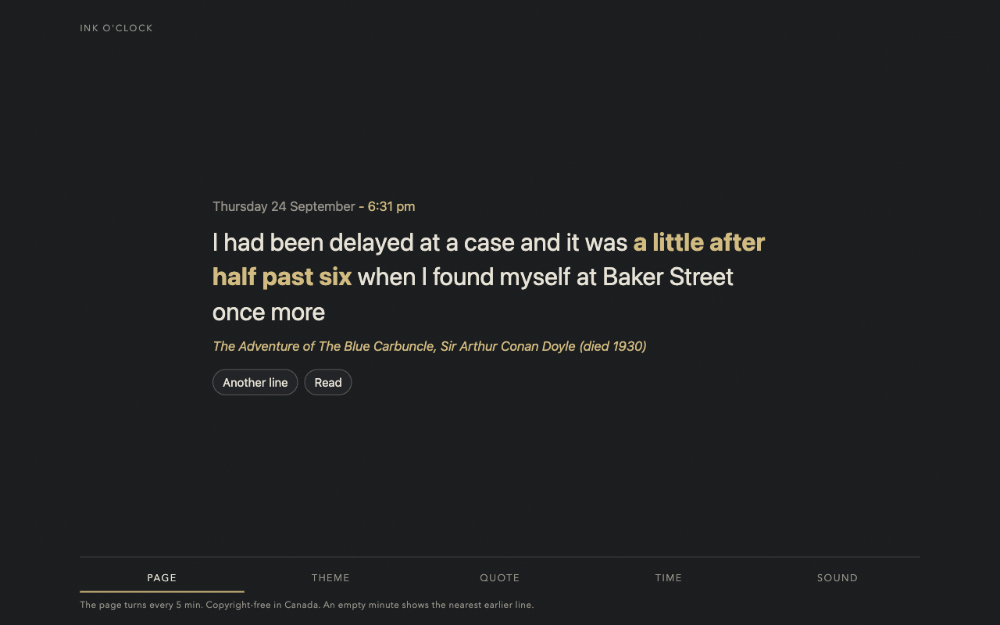
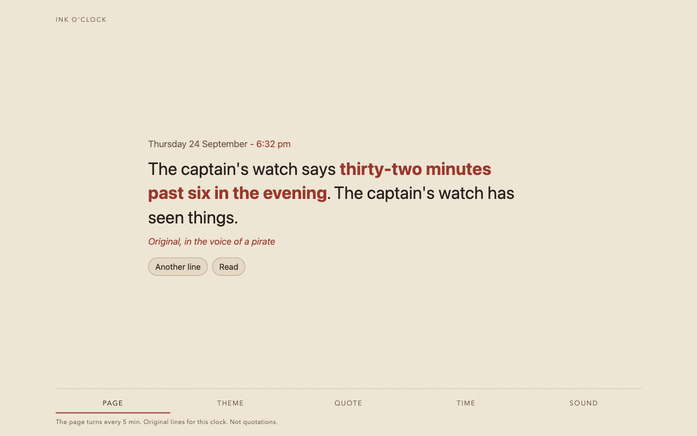

# Ink Clock

A Chrome extension that tells the time with a line from a book.

Every new tab opens a cream page: the date, the minute, a sentence that names that minute, and the title. The toolbar popup shows the same page. Nothing on the page is scraped from living authors’ novels — only **copyright-free lines** (Canada) and **original voices** written for this clock.


| | |
|---|---|
| **Install** | [Load unpacked](#install) from this folder |
| **Privacy** | [PRIVACY.md](PRIVACY.md) — also at [github.com/markusvankempen/ink-clock](https://github.com/markusvankempen/ink-clock) |
| **Chrome Web Store** | [STORE.md](STORE.md) — listing copy and submission checklist |

## Screenshots



| | |
|---|---|
|  |  |
|  |  |
|  |  |



---

## Why it exists

Ink Clock is the browser twin of the Alexa skill **Ink O’Clock**. The skill still reads the public literature-clock feed. **This extension does not.** It ships its own corpus so you can publish and use it without relying on in-copyright quotations.

---

## Quote sources

| Theme → Quote | What you get |
|---|---|
| **Books** (default) | Bundled lines free to copy in Canada (authors who died in 1971 or earlier, and the related rules used to build the file). An empty minute shows the nearest earlier readable line and says so in the credit. |
| **Surprise me** | Mixes the copyright-free books with the original voices. |
| **Yoda, Pirate, Teacher, …** | Original pastiche for this clock. Not lines from films or books. |

Sources behind **Books** include Project Gutenberg, Wikisource, Faded Page, British Library digitised books (with the gatherer’s rights checks), and old shipping journals — only where the project’s Canada rule allows them.

---

## Features

- New-tab clock and toolbar popup  
- **Another line** when more than one passage exists for that minute  
- **Read** aloud (optional automatic reading when the page turns)  
- Optional sound effects, including themed sounds that follow the voice  
- Paper looks, text size, date/time formats, time zones, layout colors  
- Page turn every 1, 5, 10, 15, 30, or 60 minutes (default **5**)

### Theme

Paper · Snow · Sepia · Sage · Slate · Cinnabar · Gallery · Midnight · Forest · Plum · Ocean · Honey  

Text size · Together / Spread layout  

### Time

Date formats · date-and-time or spoken-style clock phrase · 12- / 24-hour · device or named zones (Toronto, Eastern, … UTC)

### Sound

Read when you tap **Read**, or automatically on page turn · Chrome voice and speed · Off / Page turn / Themed sounds · Soft–Loud · optional hour chime  

Chrome may keep audio asleep until you click the page once.

---

## Install

1. Open `chrome://extensions`
2. Turn on **Developer mode**
3. **Load unpacked** → choose this `chrome` folder (the one that contains `manifest.json`)
4. Open a new tab, or click the Ink Clock icon

After you edit files, click **Reload** on the extension card.

### Keep the corpus current

From the literature-clock project root:

```bash
python3 scripts/sync_chrome_quotes.py
```

That refreshes `voices/` and `books/pd-times.txt`, then reload the extension.

### Zip for the Web Store

```bash
python3 scripts/package_chrome.py
```

Upload `dist/ink-clock-chrome.zip`. Details: [STORE.md](STORE.md).

---

## Permissions

| Permission | Why |
|---|---|
| `storage` | Saves look, schedule, quote source, and sound choices on this device |
| `tts` | Reads the line when you ask (or when auto-read is on) |

**No host permissions.** Quotes and voices are bundled. The extension does not call literature-clock.jenevoldsen.com or other quote APIs.

---

## Project layout

```
chrome/
  manifest.json
  newtab.html · popup.html
  clock.js · clock.css · shared.js · sounds.js
  books/pd-times.txt      ← copyright-free corpus
  voices/*.txt            ← original voice lines
  icons/
  README.md · PRIVACY.md · STORE.md
```

---

## Credits

- Clock-of-books idea: [Jaap Meijers](https://www.instructables.com/Literary-Clock-Made-From-E-reader/) and the literature-clock tradition  
- Copyright-free corpus: Project Gutenberg, Wikisource, Faded Page, British Library, and other sources gathered under this project’s Canada rules  
- Alexa skill **Ink O’Clock** (invocation **ink clock**) — separate product; online feed  
- Extension, voices, and packaging: Markus van Kempen  

## Author

[Markus van Kempen](https://markusvankempen.github.io/) · [markus.van.kempen@gmail.com](mailto:markus.van.kempen@gmail.com) · [github.com/markusvankempen](https://github.com/markusvankempen)

No bug too small, no syntax too weird.
